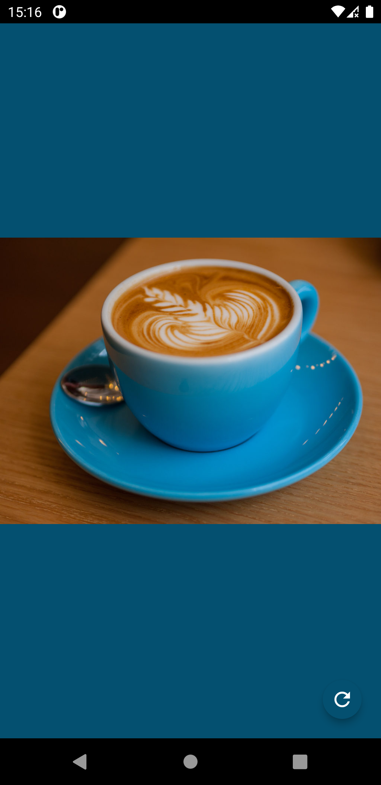
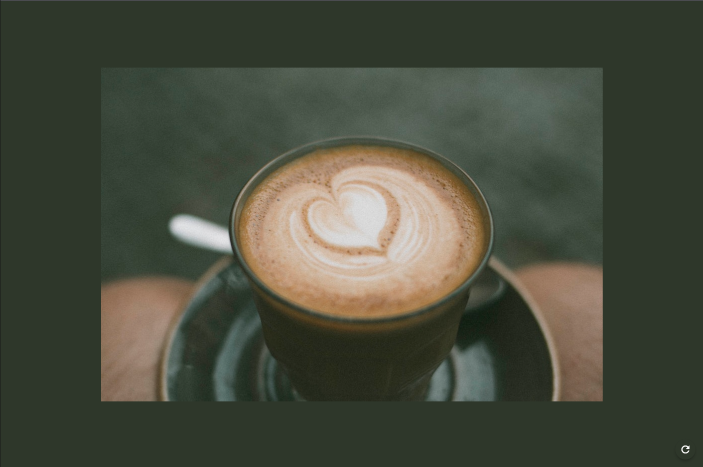

Com intuito de estudo utilizando o Flutter triple (Segmented State Pattern) este aplicativo retorna uma imagem aleatória da Api [CoffeeApi](https://coffee.alexflipnote.dev/?ref=devresourc.es)

A partir da Iamgem é gerada uma paleta de cores, onde a cor dominante da imagem se torna a cor do background da aplicação.

  

